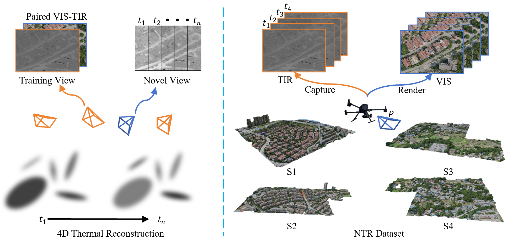

<p align="center">

  <h1 align="center">NTR-Gaussian: Nighttime Dynamic Thermal Reconstruction with 4D Gaussian Splatting Based on Thermodynamics</h1>
  <p align="center">
    <a href="">Kun Yang*</a>,
    <a href="">Yuxiang Liu*</a>,
    <a href="">Zeyu Cui</a>,
    <a href="">Yu Liu</a>,
    <a href="">Maojun Zhang</a>,
    <a href="">Shen Yan</a>,
    <a href="">Qing Wang</a>
    

  </p>
    <p align="center">
    *Corresponding authors

  </p>
  <h3 align="center"><a href="https://arxiv.org/abs/2311.17977">Paper</a> | <a href="https://asparagus15.github.io/GaussianShader.github.io/">Project Page</a></h3>
  <div align="center"></div>
</p>

## Introduction
Methods usually only perform thermal reconstruction under static conditions without considering changes in scene temperature, and are unable to dynamically represent and predict temperature variations in the scene. Traditional thermal infrared simulation methods, which rely on manually built scenes, struggle to restore real and complex three-dimensional scenes. Additionally, they fail to reflect the dynamic thermal radiation changes in the scene. We propose **NTR-Gaussian**, which can learn the emissivity, convective heat transfer coefficient, and heat capacity to predict the surface temperature of outdoor scenes at night.

<p align="center">
  <a href="">
    
  </a>
</p>
<p align="center">
  \textbf{Left}: An illustration of dynamic thermal reconstruction based on 3DGS, which learns a dynamic representation of the scene temperature from time-tagged discrete aerial TIR images paired with synthetic RGB images. \textbf{Right}: The proposed NTR dataset contains aerial TIR images with corresponding synthetic RGB images taken at multiple times in four 3D scenes.
</p>
<br>

## Installation
Provide installation instructions for your project. Include any dependencies and commands needed to set up the project.

```shell
# Clone the repository
git clone https://github.com/NPU-CVPG/NTR-Gaussian.git
cd NTR-Gaussian

# Install dependencies
conda env create --file environment.yml
conda activate ntrgs
```


## Running
Execute the optimizer using the following command:
```shell
sh train_themal.sh
```

## Rendering
```shell
python render_themal_stage2.py -m your_output_path
```

## Dataset
Download the [data](https://drive.google.com/file/d/17evbWmeZKgVeXseyVv7fNm-2Q_a17ObB/view?usp=share_link) and put it to the ``data`` folder.

## Citation
If you find this repository useful in your project, please cite the following work. :)
```
@InProceedings{Yang_2025_CVPR,
    author    = {Yang, Kun and Liu, Yuxiang and Cui, Zeyu and Liu, Yu and Zhang, Maojun and Yan, Shen and Wang, Qing},
    title     = {NTR-Gaussian: Nighttime Dynamic Thermal Reconstruction with 4D Gaussian Splatting Based on Thermodynamics},
    booktitle = {Proceedings of the Computer Vision and Pattern Recognition Conference (CVPR)},
    month     = {June},
    year      = {2025},
    pages     = {691-700}
}
```
